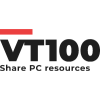

<p align="center">

</p>

Get an <i>EC2 slash SSH-like</i> experience of logging into a "VM" running an OS of your choice that's running on a mere PC of your friend sitting in his home behind a NAT! <a href="">Try it now!</a>

## Getting Started
```bash
npm install -g vt100
```

#### "Donate" your PC resources
```bash
vt init
```
...and answer a series of questions regarding how much of CPU, RAM and disk space you're willing to set aside for people to use.

#### List available resources
```bash
vt list
```
Get a listing of all the available PC resources in the network. Those who "donate" their resources will appear in this listing. Select any one and choose your OS.....**and get an interactive terminal!!**

## Key Features
- Peer to Peer :computer:—:computer: 
- Pause and resume your instance any time.
- Live metrics :chart_with_upwards_trend:
- Command history :footprints:
- Authentication and Authorization :busts_in_silhouette:
- Admin dashboard to track usage and more...
- Zero-installation **web-terminal**. <a href="">Try it now!</a>
- built-in ngrok-like feature, serve your content from your local PC and get a public URL!
## Architecture
vt100's core is built around <a href="">WebRTC</a>, a peer to peer communication standard that emerged in 2011 to add audio/video streaming capabilities directly into the browser.

The spawned "VM"s are <a href="">Docker</a> containers running on the Donor's machine. vt100 has very loose coupling with Docker and can swap out Docker for any other backend, say `chroot` or `fakeroot`. But then ofcourse, you'd lose the "select your own OS" feature. LXC seems to be a promising _near-VM_ solution. Rootless podman is yet another alternative that we can consider for bake-in solution

## Contributing
Project is still in infancy. Open to feature requests and PRs! Checkout the <a href="">Issues</a> section for interesting feature requests, enhancements and ofcourse..._bugs_
## Credits
- <a href="">wrtc</a>
- <a href="">node-pty</a>
- <a href="">commander</a>

## Acknowledgements
vt100 is a fork of <a href="">Robinhood</a>, that won us the first prize in a 4-day long hackathon organised by <a href="">Setu</a> in Feb 2022. Many thanks to my team members @Dhruv, @Sujan and @Gandharva

## Trivia
The <a href="">original DEC vt100</a> was the very first terminal that was ANSI X3.64 compliant and featured lots of innovations that we take for granted in this day. Even today, all terminal emulation software are expected to emulate the VT100 and infact the <a href="https://en.wikipedia.org/wiki/Xterm">xterm</a>'s specification is based off the humble vt100.
# README TODO
- fill in the anchor tags
- more on architecture